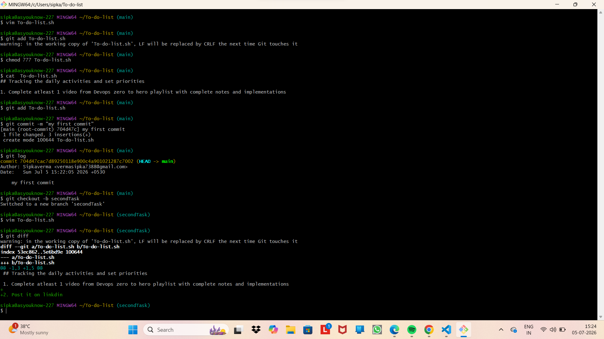
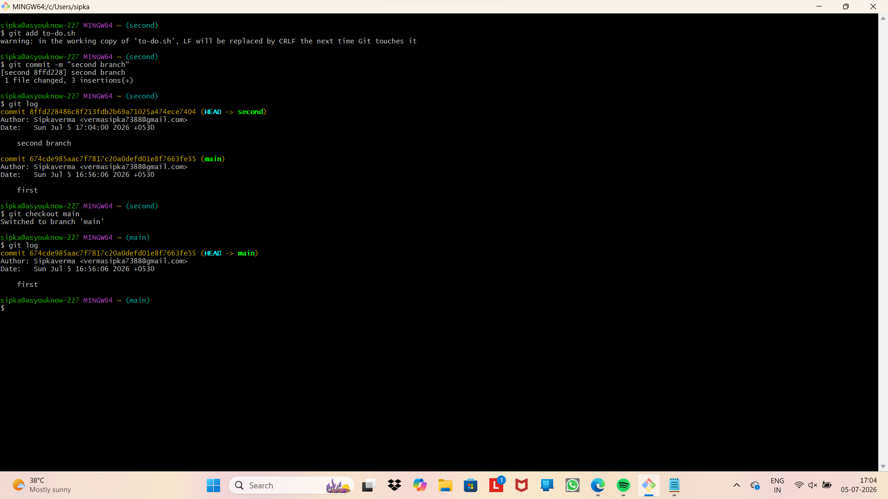
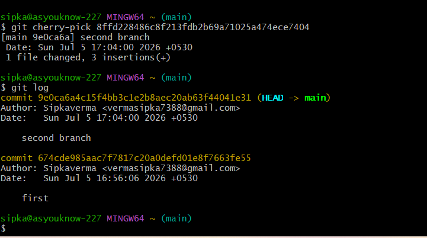
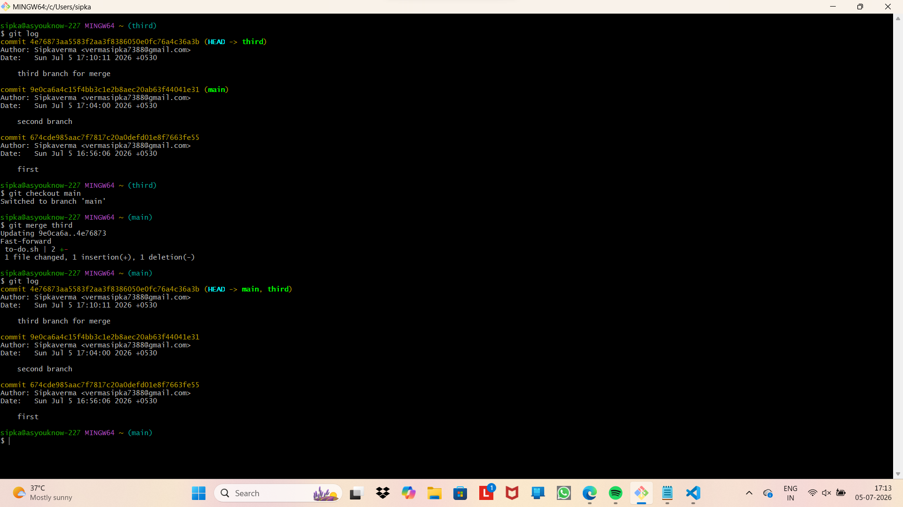
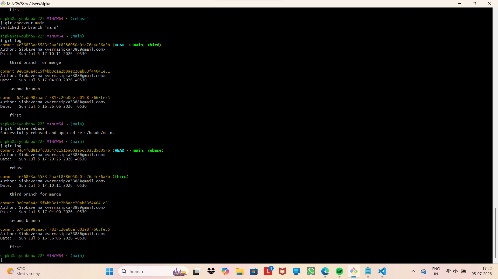

# Day 11: Git in the Real World & Interview Preparation

Welcome to Day 11 of my DevOps Learning Journey! Today's session was highly practical, focusing on how Git is actually utilized within a DevOps team and what interviewers look for when testing Git skills.

## 🚀 What I Learned Today
* **Branching Strategies:** Understood why production branches are protected and how feature branching works.
* **Hands-on Git Workflow:** Simulated a real-world developer workflow by creating branches, making modifications, and merging.
* **Resolving Merge Conflicts:** Learned how to identify and manually clean up conflict markers (`<<<<<<<`, `=======`, `>>>>>>>`).
* **DevOps Best Practices:** Learned why commit messages matter and how Git integrates with CI/CD pipelines.

## 🛠️ Commands Practiced
```bash
# Creating and switching to a feature branch
git checkout -b feature/devops-task

# Checking repository status
git status

# Pushing changes to remote
git push origin feature/devops-task


## Git bash terminal with output





