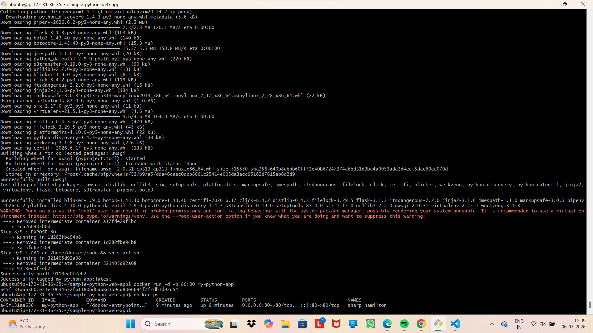
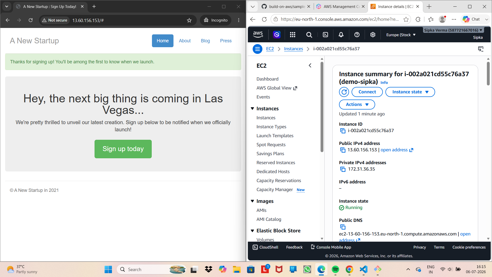
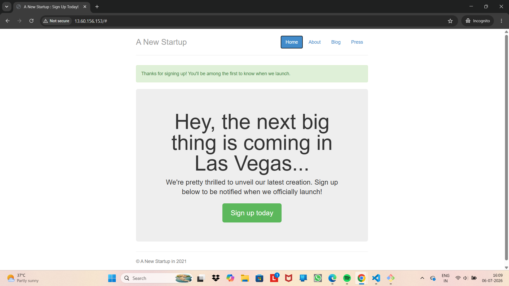

Successfully deployed a Python Web App on AWS EC2 using Docker. Check out the complete independent project here:
https://github.com/Sipkaverma/aws-docker-python-deployment.git

## Code

## 🌐Live Demo

