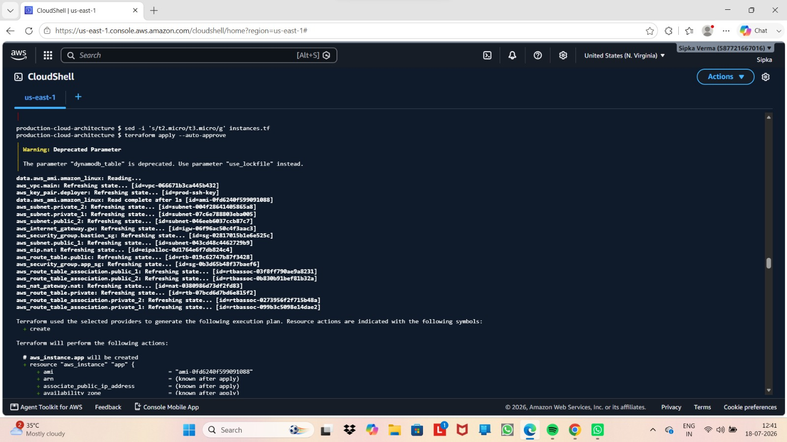
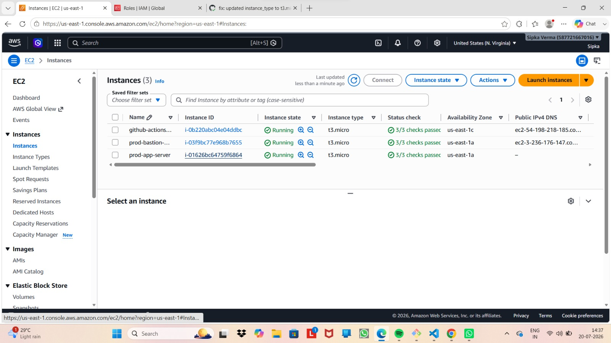
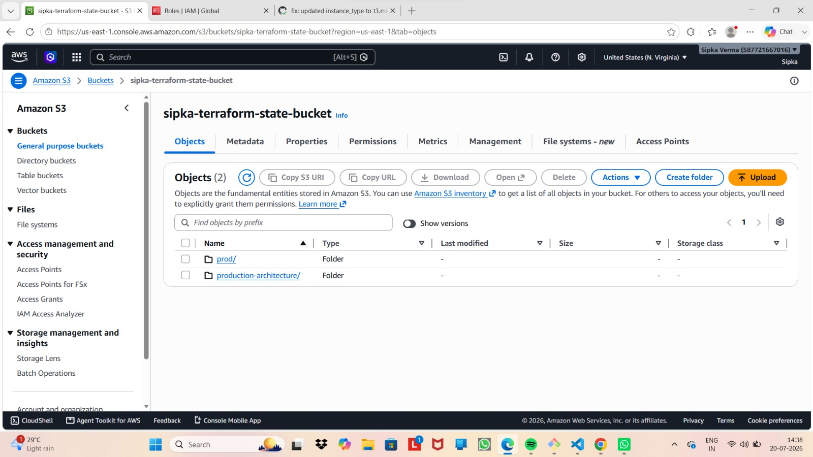
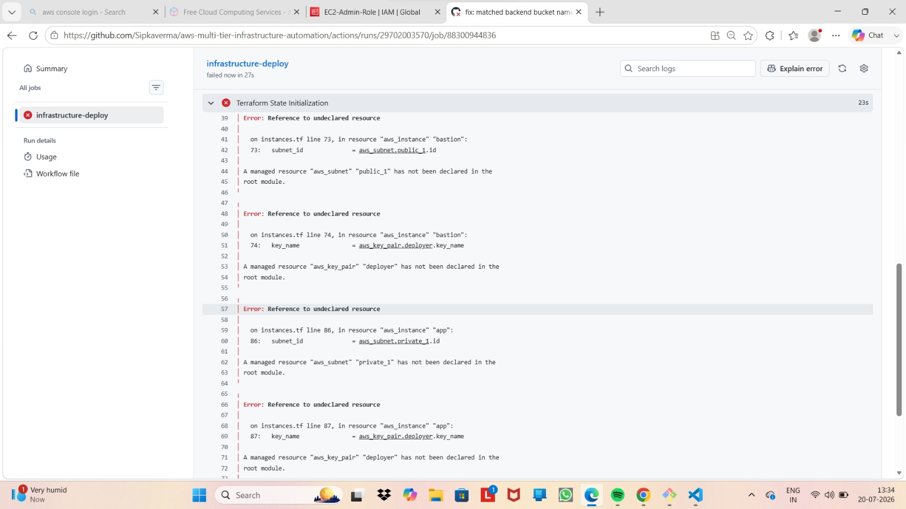

# Day 16: Infrastructure as Code (IaC) with Terraform Foundations

## Overview
This module covers the core concepts of **Declarative Infrastructure Provisioning** using HashiCorp Terraform. The primary objective was to move away from manual AWS console clicking to automating AWS Core Services (VPC, Subnets, EC2, Security Groups) using HCL (HashiCorp Configuration Language).

---

## 🛠️ Architecture & Terraform Workflow

Terraform relies on a **Declarative Execution Model**, where you define the target state, and Terraform calculates the delta between current cloud resources and desired configurations.

+------------------------+      +------------------------+      +------------------------+
|  1. terraform init     | ---> |  2. terraform plan     | ---> |  3. terraform apply    |
| (Downloads Providers)  |      | (Calculates Delta)     |      | (Provisions AWS Config)|
+------------------------+      +------------------------+      +------------------------+

### Key Components Built:
1. **Providers (`providers.tf`):** Configures the target cloud API driver (AWS `us-east-1`).
2. **Variables (`variables.tf`):** Parameterizes regions, instance types (`t3.micro`), and CIDR blocks to avoid hardcoding.
3. **Core Infrastructure (`main.tf`):** Provisions Custom VPC, Public/Private Subnets, Internet Gateways, and EC2 instances.
4. **Outputs (`outputs.tf`):** Exposes key runtime properties (e.g., `bastion_public_ip`, `vpc_id`).

---

## 🚀 Execution Commands

# Initialize working directory and download hashicorp/aws provider
terraform init

# Validate configuration syntax and formatting
terraform validate

# Generate and review execution plan
terraform plan

# Apply changes to provision resources in AWS
terraform apply -auto-approve

### 🔧 Debugging & Common Syntax Errors
* Duplicate Output Definitions:

Issue: Error: Duplicate output definition occurred when bastion_public_ip was declared in both outputs.tf and instances.tf.

Fix: Unified output parameters exclusively inside outputs.tf to maintain module scope uniqueness.

# Day 17: Advanced Terraform – S3 Remote State, Locking & GitHub Actions Integration

## Overview
This module demonstrates **Production-Grade Infrastructure Management** using Terraform. It focuses on resolving local state vulnerability by implementing a **Remote S3 Backend**, managing state locking, modularizing infrastructure code, and automating execution via **GitHub Actions Self-Hosted Runners**.

---

## 🛠️ Architecture: Remote State & Automation Pipeline

+--------------------------+      Git Push       +------------------------------------+
| Local Engineer Workspace | ------------------> | GitHub Repository / Actions Runner |
+--------------------------+                     +-----------------+------------------+
|
Executes     | terraform apply
v
+------------------------------------+
|        AWS Infrastructure          |
|  +------------------------------+  |
|  | S3 State Bucket              |  |
|  | (sipka-terraform-state-bucket)|  |
|  +------------------------------+  |
|  | EC2, VPC, IAM, Security Grps |  |
|  +------------------------------+  |
+------------------------------------+
### Key Technical Implementations:
1. **S3 Remote Backend:** Migrated local `.tfstate` to centralized, versioned AWS S3 bucket for team synchronization.
2. **Modular Architecture:** Structured resources into reusable VPC, Security, and Compute modules.
3. **Automated CI/CD:** Deployed self-hosted GitHub Actions runners on AWS EC2 with scoped IAM policies.

---

## 🚀 Backend Configuration (`backend.tf`)

terraform {
  backend "s3" {
    bucket         = "sipka-terraform-state-bucket"
    key            = "devops/multi-tier/terraform.tfstate"
    region         = "us-east-1"
    encrypt        = true
  }
}

### 🔧 Real-World Engineering Debugging Logs
404 Not Found Bucket Error:

Issue: Pipeline failed during terraform init due to string mismatch between S3 bucket name in AWS Console (sipka-terraform-state-bucket) and code (sipka-devops-terraform-state).

Fix: Synchronized exact string parameters across backend HCL definitions and updated state key references.

AWS IAM Access Permission Escalation (403 Forbidden):

Issue: Self-hosted EC2 runner lacked credentials to fetch S3 backend state workspace.

Fix: Attached custom EC2-Admin-Role IAM policies to the runner instance and allowed propagation.

## Implementations of Day 16 & day 17

