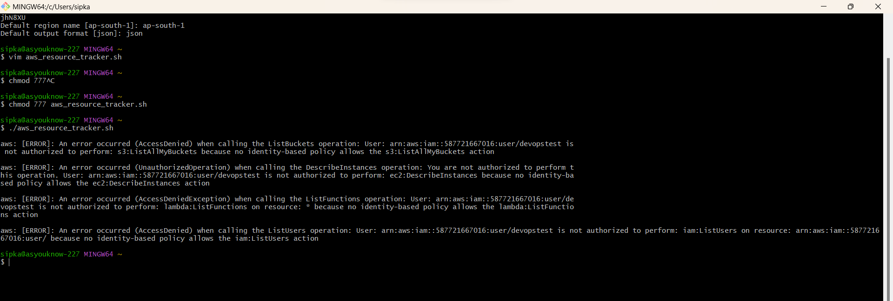
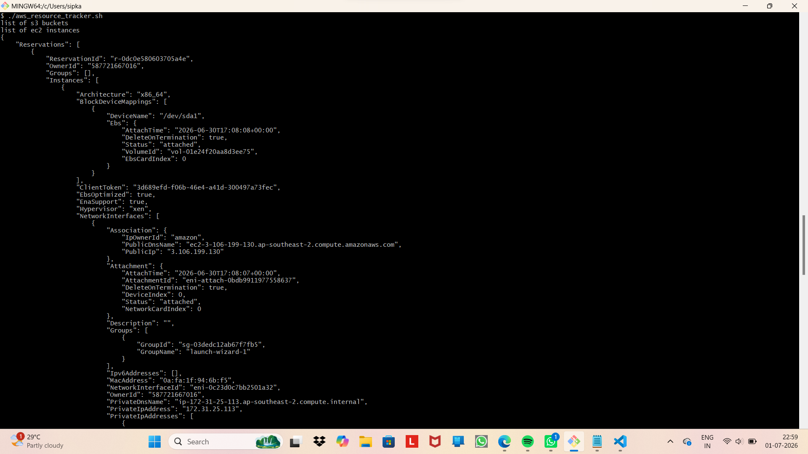
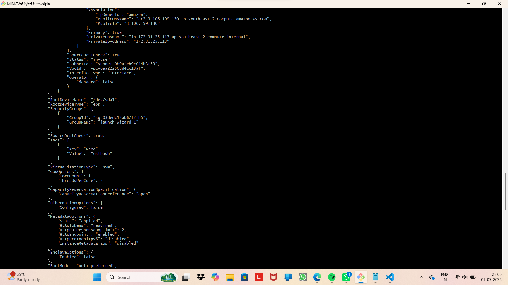
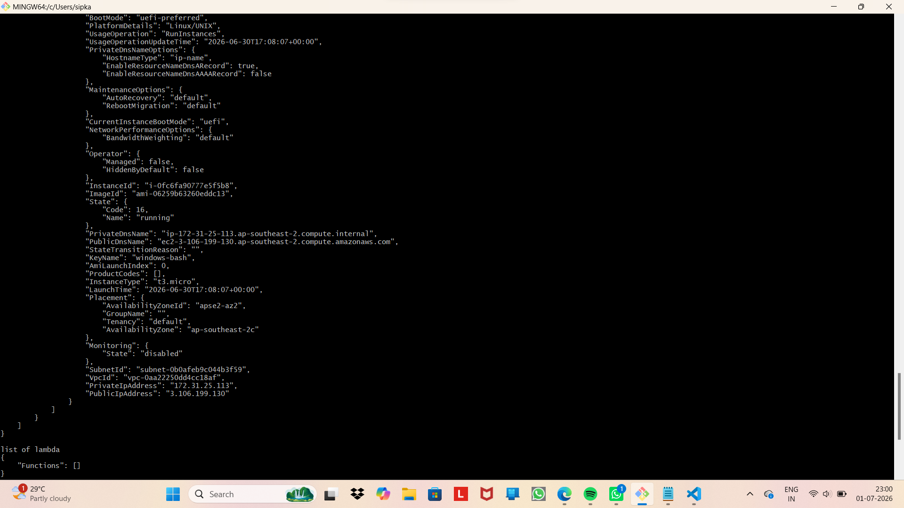

# 🚀 AWS Resource Tracker – DevOps Learning Project

## 📖 Overview
This project is part of my DevOps learning journey (Day‑7).  
It demonstrates how to automate AWS resource monitoring using **Shell Scripting** and the **AWS CLI**.  
The goal is to generate daily reports of AWS resources (EC2, S3, Lambda, IAM) to identify unused assets and optimize cloud costs.

---

## 🎯 Objectives
- Learn Bash scripting fundamentals for automation.
- Use AWS CLI to interact with cloud services programmatically.
- Parse JSON outputs with `jq` for clean reporting.
- Schedule scripts with **cron jobs** for daily execution.
- Apply debugging techniques (`set -x`) to trace script execution.

---

## 🛠️ Tech Stack
- **Language:** Bash (Shell Script)
- **Tools:** AWS CLI, jq
- **Platform:** AWS Cloud
- **Scheduler:** Cron

---

## ⚙️ Implementation

### 1. Configure AWS CLI
```bash
aws configure
```
Set up access key, secret key, region, and output format.

### 2. Script File
`aws_resource_tracker.sh`
```bash
#!/bin/bash
# Author: Sipka
# Version: v1.0

set -x  # Enable debugging

echo "Listing S3 Buckets..."
aws s3 ls

echo "Listing EC2 Instances..."
aws ec2 describe-instances --query "Reservations[*].Instances[*].InstanceId" --output text

echo "Listing Lambda Functions..."
aws lambda list-functions --query "Functions[*].FunctionName" --output text

echo "Listing IAM Users..."
aws iam list-users --query "Users[*].UserName" --output text
```

### 3. Schedule with Cron
Run script daily at 8 PM:
```bash
crontab -e
0 20 * * * /path/to/aws_resource_tracker.sh
```

---

## 📌 Best Practices
- Always add headers and inline comments in scripts.
- Keep logs structured for easier monitoring.
- Use cron jobs for consistent automation.
- Regularly review AWS CLI documentation for updates.

---

## 📊 Learning Outcomes
- Strengthened understanding of **automation in cloud management**.
- Learned how to integrate Bash + AWS CLI for lightweight monitoring.
- Gained hands‑on experience with scheduling and debugging scripts.

---

## 📝 Next Steps
- Extend script to track **unused EBS volumes** and **idle EC2 instances**.
- Integrate with **CloudWatch** for advanced monitoring.
- Add cost‑optimization checks.

GOOD PRACTICE WHILE FACING ERROR:


1. So, its always a good practice to create your inline policy.
2. And create your group 
3. And copy the access key and secret access key safely.

OUTPUT:



